### 项目名称：基于Spring Boot开发的编程资源分享网站

------

### 一、项目开发环境：

- 开发工具：IntelliJ IDEA 
- 数据库：MySQL8
- jdk1.8

------

### 二、项目成果访问方式

- 前台：[https://pns.weiyuexin.top/](https://pns.weiyuexin.top/)
- 后台管理系统：[https://admin.pns.weiyuexin.top/](https://admin.pns.weiyuexin.top/)

------

### 三、项目所用技术

- 前端
  - layui、JQuery、css、html、UEditor、Font-Awesome、LAYUI MINI
- 后端：
  - SpringBoot
  - [ MyBatis-Plus](https://baomidou.com/)
  - Hutool
- 服务器：
  - 系统：CentOS 7
  - 反向代理：nginx

------

### 四、功能简介

  一、前端UI：

  （1）、用户方面：

  1、可以查询阅览各种技术、软件的资料

  2、对编程技术进行了一系列划分，每个分类都包含技术博客、学习资料等内容，便于用户理解学习。

  3、社交功能，不同用户之间可以互动

  4、个人页面，对个人资料的一些整理，收藏，心愿记录，消息通知等，且用户可以在此编辑修改自己的头像、昵称、学校、联系方式、地址等信息。

  5、用户可以分享技术博客以及学习资料，首页会展示精选的博客、学习资料以及热点技术信息等。

  6、设有全局搜索功能，用户可以自定义搜索自己想要查看的内容。

  7、设有心愿墙模块，用户可以在心愿墙发布自己想要寻找的资料或者想要解决的问题，其他用户看到后可以联系帮助实现心愿，实现心愿可以获得一定的积分。

   

  （2）、管理员方面：

  基于用户的基础上增添了一部分功能：

  1、对社区交流具有管理权力，能对用户的不正当发言进行调整

  2、对用户上传的资源有审核通过上架的权力，例如用户上传了关于Docker的知识资料卡，需提交经管理员审核通过后才能显示与前台；

  二、后台管理系统：

    1、普通用户方面：可以浏览个人的数据，修改与个人相关的数据，没有实际的大的操作权力，可以查看修改自己的信息，查看已发布的博客文章和学习资料。
    
    2、管理员方面：管理整个系统的用户，实现CURD功能，查看并操作系统日志，用户管理、内容审核、后台维护等，管理员分为普通管理员和超级管理员，超级管理员权限最高。

  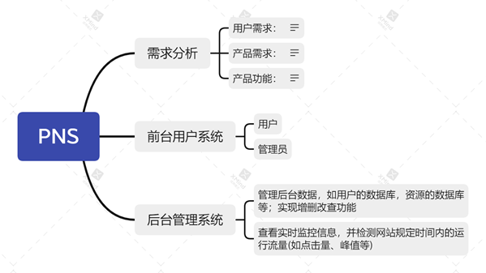

  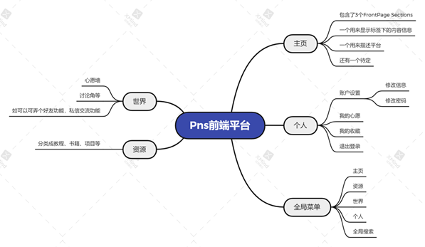

  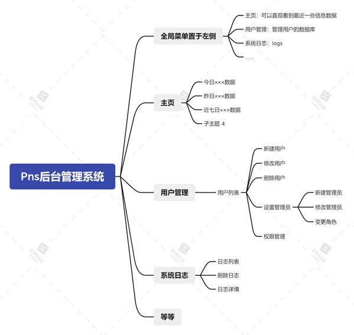

###  五、 项目特色

- 所有图片及文件都存储在腾讯云对象存储，保证了静态资源的访问速度和安全性

- 使用IP工具，可以对用户登录、发布文章的资源时的IP地址的IP属地进行管理

- 实现了邮箱验证码功能，可以使用验证码注册、登录以及重置密码

- 界面设计美观，使用方便简洁

- 实现模糊搜索功能，前台可以搜索文章，后台管理系统可以对所有管理的内容进行搜索

- 对用户密码进行md5加密，保证了系统的安全性

- 后台管理系统可以查看用户的登录操作日志

  ### 六、程序运行截图

  首页（未登录）

  

  首页分类展示文章：

  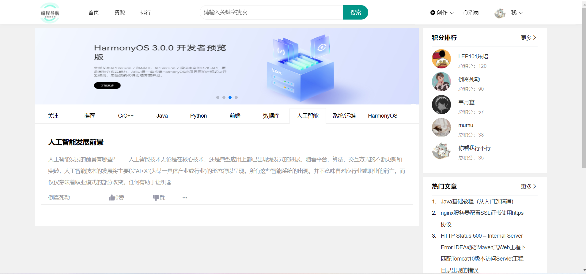

  文章详情页：

  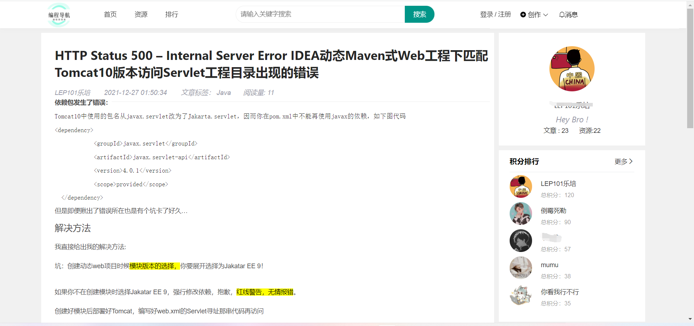

  文章详情页后的评论：

  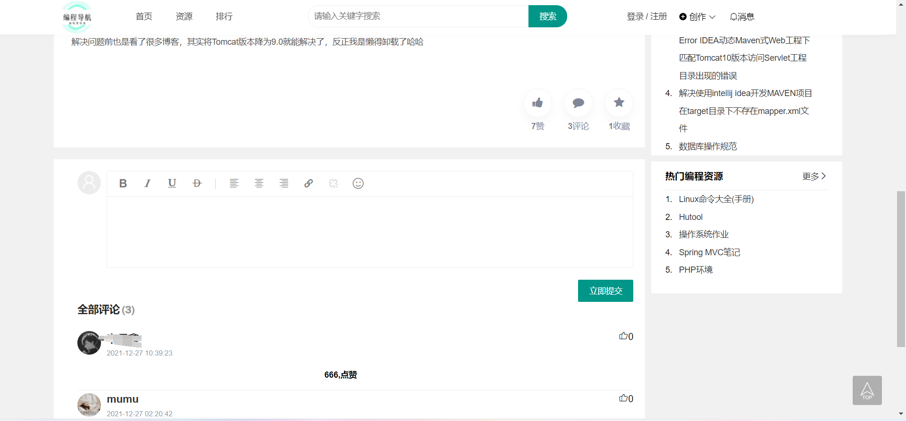

  文章点赞：

  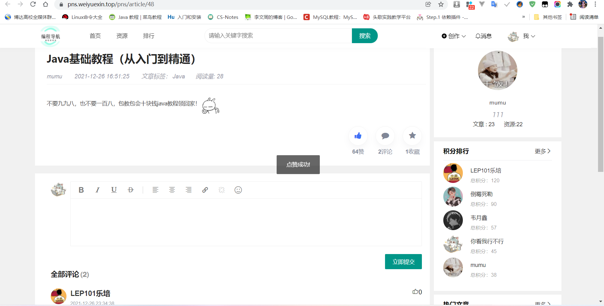

  文章评论：

  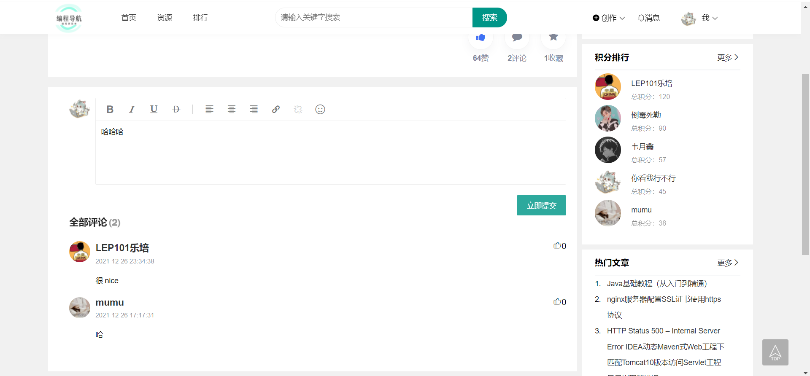

  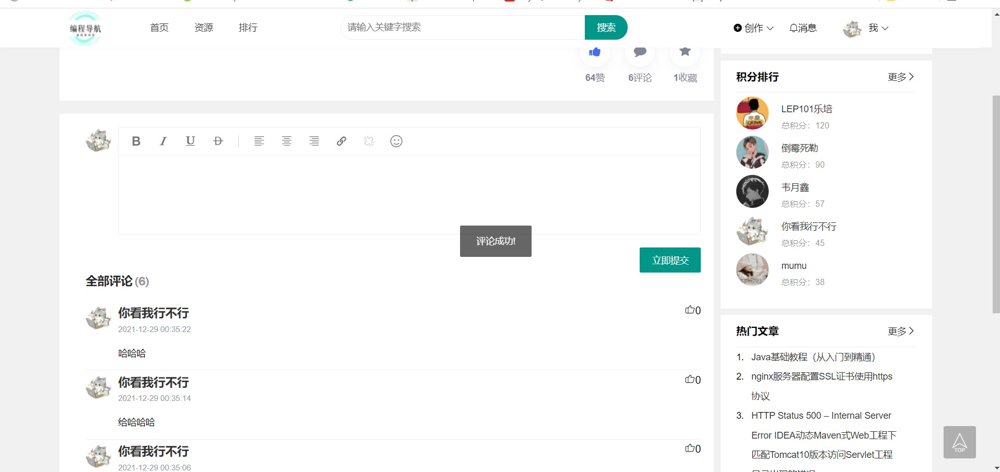

  积分排行榜：

  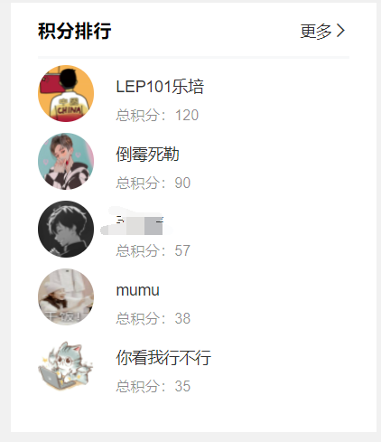

  文章&资源排行榜：

  

  密码登录界面：

  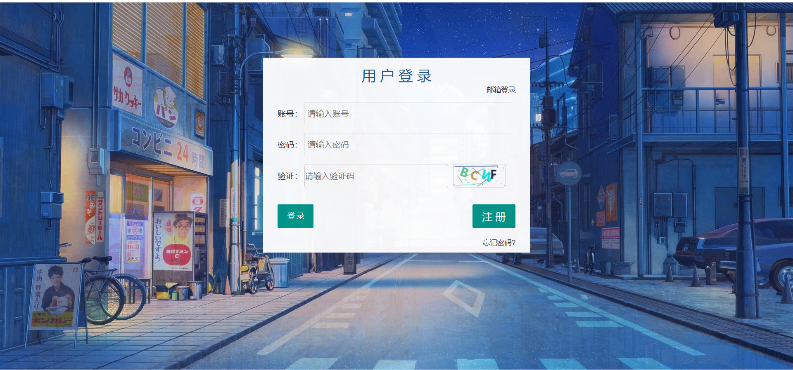

  邮箱登录界面：

  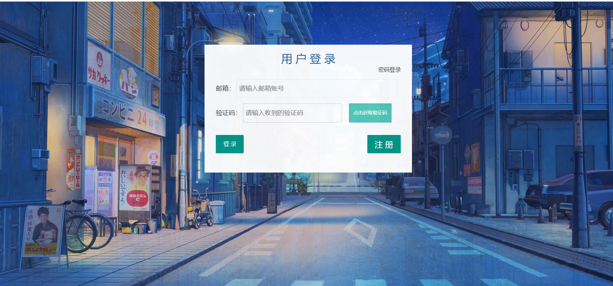

  邮箱注册界面：

  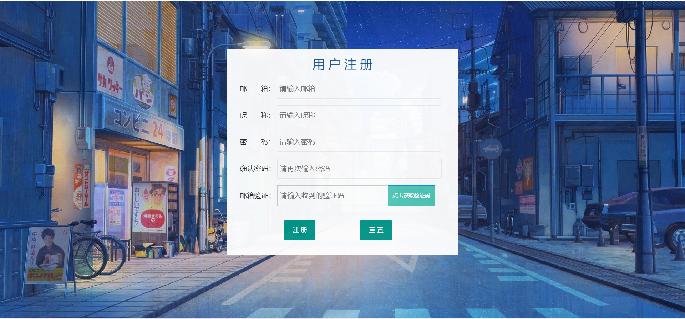

  登录后的效果：

  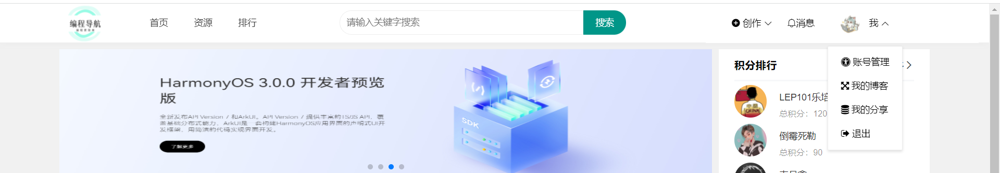

  个人信息：

  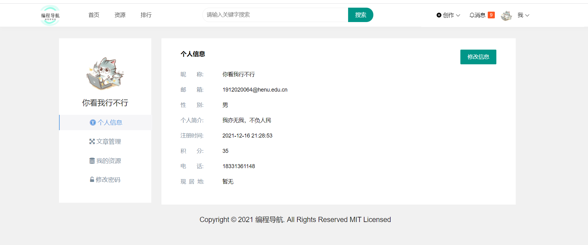

  我的文章：

  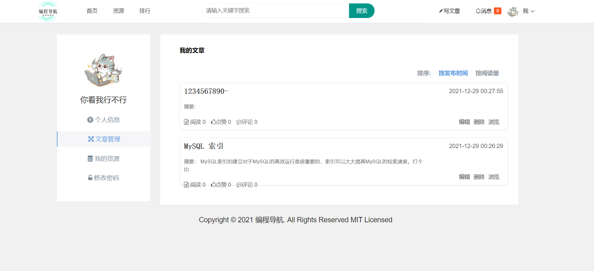

  我的资源：

  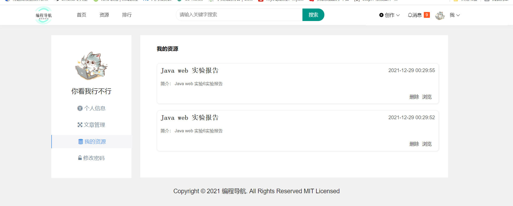

  修改密码：

  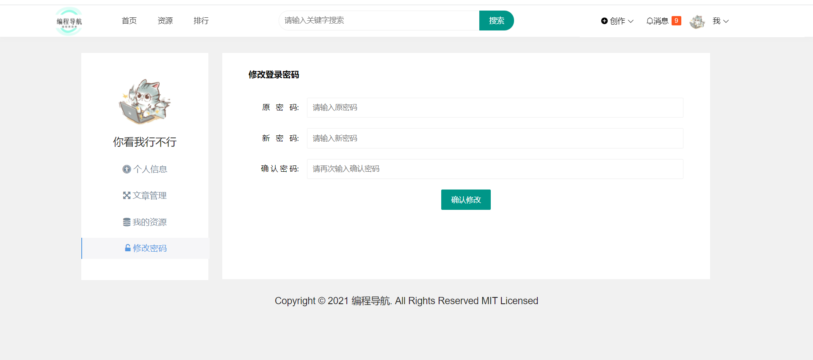

  发表文章页面：

  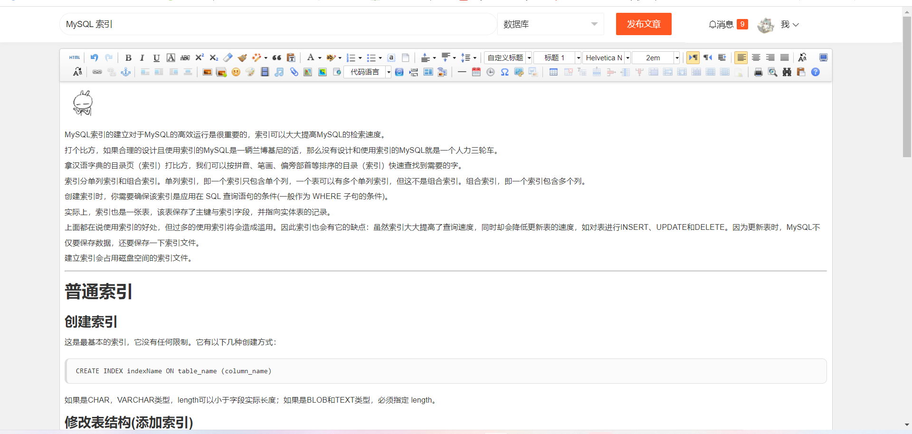

  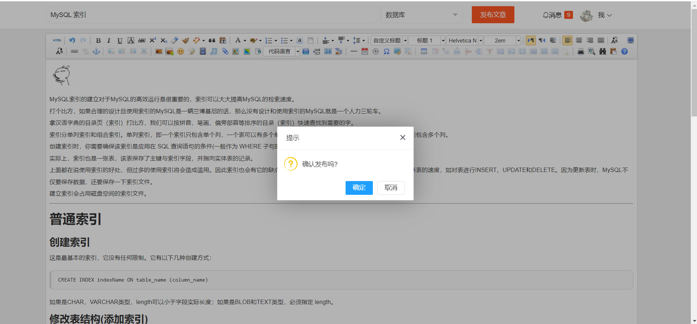

  发布资源：

  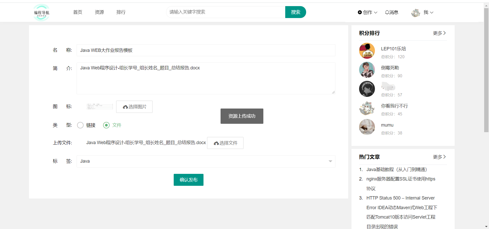

  资源列表：

  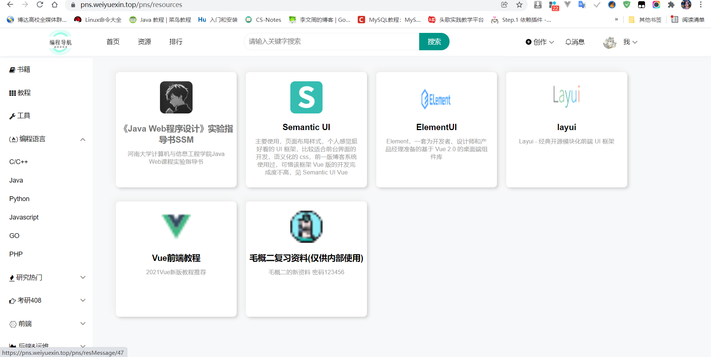

  资源详情：

  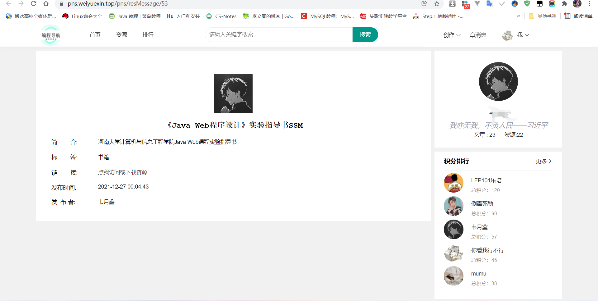

  排行榜：

  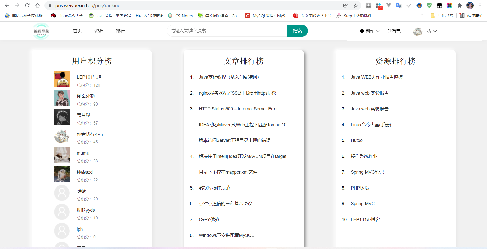

  
